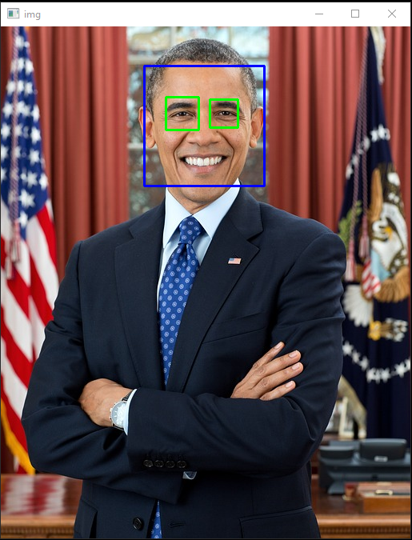

# Face and Eye Detection using OpenCV

This project demonstrates face and eye detection in images using OpenCV's Haar cascade classifiers. The program loads an image, converts it to grayscale, and then detects faces and eyes, highlighting them with rectangles.

## Requirements

- Python 3.x
- OpenCV
- NumPy

## Installation

1. Install Python 3.x from the [official website](https://www.python.org/downloads/).
2. Install the required Python packages:
   ```bash
   pip install numpy opencv-python
   ```
3. Usage

   - Save the script below as

   ```code.py:
   import numpy as np
   import cv2

   # Load the Haar cascades
   face_cascade = cv2.CascadeClassifier('D:/A/Face Detection In Images/dataSet/haarcascade_frontalface_default.xml')
   eye_cascade = cv2.CascadeClassifier('D:/A/Face Detection In Images/dataSet/haarcascade_eye.xml')

   # Read the image
   img = cv2.imread(r"D:/A/Face Detection In Images/img/barack-obama.jpg")  # nama_file(.jpg)

   # Convert the image to grayscale
   gray = cv2.cvtColor(img, cv2.COLOR_BGR2GRAY)

   # Detect faces in the image
   faces = face_cascade.detectMultiScale(gray, 1.3, 5)

   # Draw rectangles around detected faces and eyes
   for (x, y, w, h) in faces:
       cv2.rectangle(img, (x, y), (x + w, y + h), (255, 0, 0), 2)
       roi_gray = gray[y:y + h, x:x + w]
       roi_color = img[y:y + h, x:x + w]
       eyes = eye_cascade.detectMultiScale(roi_gray)
       for (ex, ey, ew, eh) in eyes:
           cv2.rectangle(roi_color, (ex, ey), (ex + ew, ey + eh), (0, 255, 0), 2)

   # Display the output image
   cv2.imshow("img", img)

   # Wait for the user to press a key
   while True:
       # If 'e' is pressed, exit the program
       if cv2.waitKey(1) & 0xFF == ord('e'):
           break

   # Clean up and close windows
   cv2.destroyAllWindows()

   ```

4. Make sure the paths to the Haar cascade XML files and the image file are correct.
5. Run the script:
   ```bash
   python code.py
   ```
6. The program will display the image with detected faces and eyes outlined in rectangles. Press the 'e' key to exit the program.

## Notes

- Ensure that the paths to the Haar cascade files and the image file are correctly set in the script.
- The default paths in the script are for Windows. Adjust them if you are using a different operating system.

## Results

- The following are the results of the program that has been executed with the python code.py command resulting in:



## Conclusion

- This project effectively demonstrates the use of OpenCV's Haar cascade classifiers for detecting faces and eyes in images. By following the installation steps and using the provided Python script, you can easily implement face and eye detection in your own images. The program is straightforward to use and highlights the detected regions with rectangles, providing a clear visualization of the results. This project serves as a solid foundation for more advanced computer vision applications involving facial recognition and object detection.
